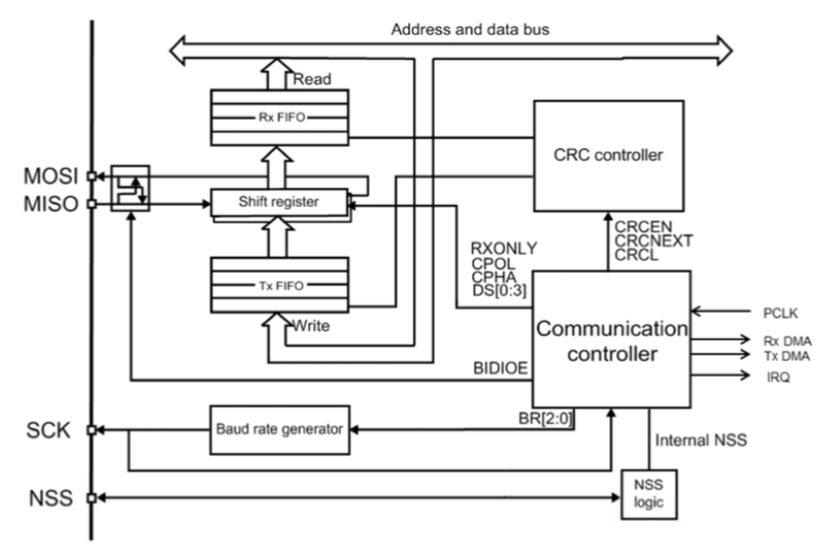
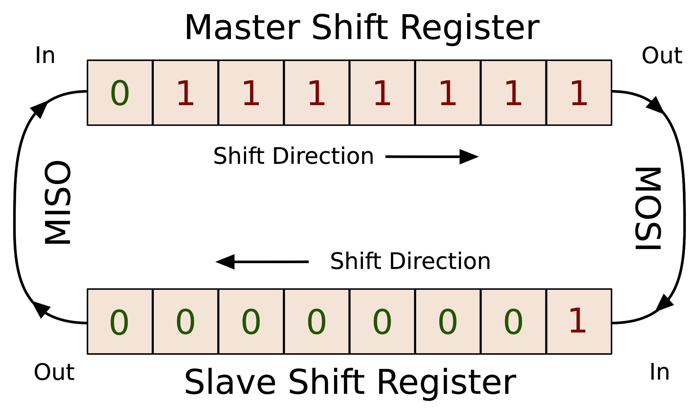
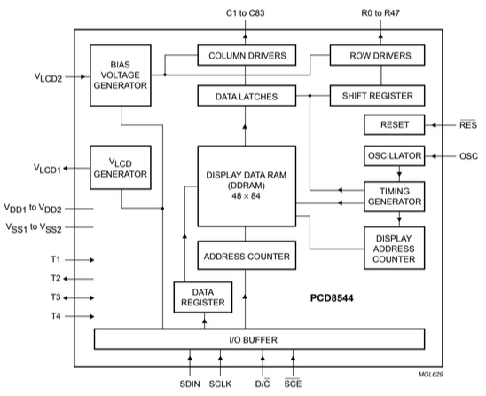
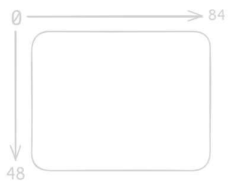
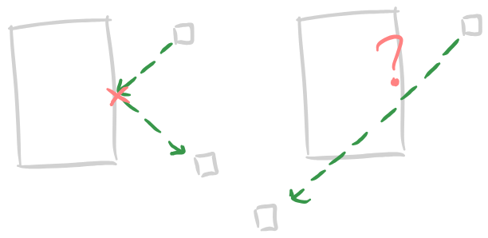

# Air Hockey - V0.1
Por Davi da Silva Schuch e Edrick Thomé de Oliveira \
Sistemas Microprocessados II - Professor Marcos Zuccolotto

## Sumário
- [Briefing](#briefing)
    - [Tecnologias Utilizadas](#tecnologias-utilizadas)
- [SPI](#spi)
    - [Pinos](#pinos)
    - [Shift Register / Modos de Operação](#shift-register--modos-de-operação)
    - [Polaridade e fase de Clock](#polaridade-e-fase-de-clock)
- [Display LCD Nokia 5110](#display-lcd-nokia-5110)
    - [Pinos](#pinos-1)
    - [Biblioteca](#biblioteca)
- [Game](#game)
    - [Ordem e Atualização](#ordem-e-atualização)
        - [Orientação do Display](#orientação-do-display)
        - [Taxa de Atualização](#taxa-de-atualização)
    - [Colisão](#colisão)
        - [Limites da tela](#limites-da-tela)
        - [Colisão entre Objetos](#colisão-entre-objetos)
        - [Aceleração do Disco](#aceleração-do-disco)
        - [Tunneling](#tunneling)

## Briefing
O seguinte projeto implementa uma adaptação de um jogo de air hockey para o âmbito digital, utilizando um display LCD para a exibição do jogo e um módulo de acelerômetro e giroscópio para o controle.

### Tecnologias Utilizadas
- Microcontrolador STM32F446RE
- MPU6050 - Acelerometro e giroscópio de 3 eixos
- Display Nokia LCD 5110
- Comunicação serial SPI, para o display, e I2C, para o acelerometro

## SPI
O protocolo SPI é um método de comunicação serial utilizado em curtas distâncias, utilizado principalmente para sistemas embarcados. A comunicação funciona em um sistema Mestre-Escravo, o que significa que o gerador do sinal de sincronismo é definido como mestre e todos os dispositivos que utilizam desse sinal para sincronização são chamados de escravos.
O protocolo também funciona com um canal Full Duplex, capaz de enviar e receber dados simultaneamente, Half Duplex, e Uniplex, somente transmitindo ou somente recebendo dados.

### Pinos
A comunicação do protocolo é efetuada através de quatro pinos, conforme a tabela abaixo:

| Nome | Pino | Propósito |
| - | - | - |
| Master Out Slave In | MOSI | Envio de comandos do mestre para o escravo |
| Master In Slave Out | MISO | Envio de comandos do escravo para o mestre |
| Serial Clock | SCK | Envio do clock do mestre para os escravos |
| Slave Select | SS | Ativação da comunicação com o dispositivo escravo |

Nome alternativos são possíveis, como vamos ver posteriormente no display LCD utilizado, devido a falta de padronização, cabendo a correta interpretação do usuário com base na documentação e na ação a ser executada.

### Shift Register / Modos de Operação
A comunicação SPI ocorre por meio de um registrador de deslocamento, ou shift register, que, a cada borda de subida do clock do dispositivo, move um bit do registrador de dados para a direita.

Por ser um registrador compartilhado pelas filas de transmissão (Tx FIFO) e recepção (Rx FIFO), a interação com o mesmo pode depender do modo de operação. Segue um diagrama em blocos simplificado do funcionamento de um dispositivo mestre SPI.

\
*Fonte: STM32 SPI Documentation*

Observe que o pino MOSI retira o valor da última posição do registrador e o MISO insere um valor na primeira posição. Além disso, a fila de transferência, que contém os dados que se deseja enviar a outro dispositivo por meio do MOSI, é copiada para o shift register. A fila de recepção, por sua vez, recebe o valor do shift register, guardando os valores recebidos de outro dispositivo por meio do MISO.

No caso de uma comunicação simultânea entre o mestre e o servo, a cada bit enviado pelo MOSI, um bit é retornado pelo MISO, ciclando o shift register conforme a figura abaixo:
\
*Fonte: Hackaday*

Para o seguinte projeto, contudo, utilizaremos uma comunicação Uniplex, visto que o display utilizado não só necessita apenas dos dados enviados de forma serial síncrona, independente do protocolo, como o mesmo não apresenta uma saída de dados própria.

### Polaridade e fase de Clock
O padrão SPI nos permite a configuração de como o clock será tratado pelos dispositivos por meio de duas variáveis, a polaridade (CPOL), e a fase (CPHA). 

A polaridade nos indica qual o estado inicial do clock, também conhecido como idle do clock, e a fase nos indica se a leitura iniciará ou não na primeira iteração de clock. Se a polaridade for 0, o clock iniciará em baixo, se for 1, em alto. Se a fase for 0, a leitura ocorrerá na primeira iteração do clock, se for 1, ocorrerá na segunda.

Para melhor entendimento, interprete da seguinte maneira: 

| CPOL | CPHA | Leitura | Transição |
| - | - | - | - |
| 0 | 0 |  Primeira borda de subida | Primeira |
| 0 | 1 | Primeira borda de descida | Segunda |
| 1 | 0 | Primeira borda de descida | Primeira |
| 1 | 1 | Primeira borda de subida | Segunda |

Segue o gráfico para melhor entendimento:

\
*Fonte: STM32 SPI Documentation*

**Fontes:**
- "Interface serial SPI", material desenvolvido e disponibilizado pelo professor Zuccolotto
- [STM32 Serial Peripheral Interface](https://www.st.com/content/ccc/resource/training/technical/product_training/group0/3e/ee/cd/b7/84/4b/45/ee/STM32F7_Peripheral_SPI/files/STM32F7_Peripheral_SPI.pdf/_jcr_content/translations/en.STM32F7_Peripheral_SPI.pdf), por STMicroelectronics
- [Comunicação SPI – Parte 1](https://embarcados.com.br/spi-parte-1/), por embarcados.com.br
- [Comunicação SPI - Parte 2](https://embarcados.com.br/comunicacao-spi-parte-2/), por embarcados.com.br
- [What could go wrong: SPI](https://hackaday.com/2016/07/01/what-could-go-wrong-spi/), por hackaday.com

## Display LCD Nokia 5110
O dispositivo utilizado para output foi o display LCD 5110, conhecido por ter grande disponibilidade e um baixo custo. Com 48 linhas e 84 colunas, o display possuí apenas uma cor, taxa máxima de recepção serial de 4 Mpbs e compatibilidade a inputs CMOS.

### Pinos
Segue a pinagem conforme o dispositivo utilizado. Leve em conta que os nomes podem ter mudanças devido a falta de padronização.

| Nome | Pino | Propósito |
| - | - | - |
| - | VCC | Tensão de alimentação |
| - | GND | Ponto comum / Terra | 
| Back Light | BL | Iluminação do display |
| Data Input | DIN | Entrada de dados seriais |
| Clock | CLK | Entrada do clock |
| Chip Enable | CE | Ativa o recebimento de dados seriais |
| Data/Command | D/C | Muda o modo de operação do display |
| Reset | RST | Limpa a memória do display |

\
*Fonte: Documentação ETT*

Por conta das características do display, o memso não possuí saída de sinal e depende apenas da saída de dados e do clock do dispositivo mestre. Por conta disso, utilizaremos apeans a saída do mestre na configuração do protocolo SPI, como citado anteriormente.

Para seu pleno funcionamento, o controle dos pinos de reset, data/command e chip enable deve ser feito manualmente.

### Biblioteca
Munidos da documentação do display e do protocolo, podemos criar o controle do display por conta própria. Porém, para facilitar nosso trabalho, utilizaremos uma biblioteca públia disponível no Github. Com isso, conseguimos abstrair parte do processo de controle do display, visto que os comandos de iniciação, envio de dados e chaveamento das portas já estão prontos e conforme a documentação.

A biblioteca utilizada foi a "winxos/stm32_hal_lcd5110_hw_spi", retirada no dia 23 de maio de 2025. A mesma está disponível [neste link](https://github.com/winxos/stm32_hal_lcd5110_hw_spi). 

## Game
O jogo consiste de dois objetos, um "disco" e um "manche", ambos blocos. A interação dos mesmos ocorre no contato, ou seja, é necessário programar um sistema de colisão. Para isso, ambos os objetos devem ter posição, direção, velocidade, entre outros atributos. 

### Ordem e atualização
#### Orientação do display
A orientação do display não segue a orientação do plano cartesiano, com o eixo x seguindo o padrão, aumentando para a direita, e o eixo y invertido, crescendo para baixo.

\
*Fonte: Autoria Própria*

#### Taxa de atualização
Para facilitar a programação e utilizar outras ferramentas disponíveis no microcontrolador, a velocidade será definida por um timer, onde o mesmo regula a taxa de atualização da posição do objeto.

Para exemplificar, o código abaixo é um exemplo simplificado da atualização da posição da bola.

```
void HAL_TIM_PeriodElapsedCallback(TIM_HandleTypeDef *htim) {
	if (htim->Instance == TIM11) {  //10Hz
		moveBall(); //atualização da posição da bola
    }
    if (htim->Instance == TIM14) {  //50Hz
        ... //atualização da tela
    }
}

void moveBall() { //aumenta ou diminui a posição em um
    if (ball.xDirection == UP) ball.xPosition = ++ball.xPosition;
    else ball.xPosition = --ball.xPosition;

    if (ball.yDirection == LEFT) ball.yPosition = ++ball.yPosition;
    else ball.yPosition = --ball.yPosition;
}
```

### Colisão
A colisão é o ponto central do jogo, pois quando os objetos colidem o movimento do jogador se transforma em movimento do disco. Atualmente, a colisão aplicada no projeto é uma colisão discreta, ou seja, analisa se os objetos estão colidindo no momento atual.

#### Limites da tela
A primeira colisão a ser aplicada é muito simples, é a colisão de limite de tela. Caso o bastão bata em um dos limites de tela, seu avanço é bloqueado. Para a bolinha, temos que verificar em qual dos limites a mesma chegou. Caso seja em um dos limites horizontais, matemos sua direção no eixo x e invertemos a direção do eixo y, vice-versa para os limites verticais.

#### Colisão entre objetos
A colisão entre objetos ocorre quando um dos lados ou diagonais de um objeto está na mesma posição que os lados ou diagonais de outro. Para tal verificação precisamos encontrar tais posições a cada instante. Sabendo que a posição a qual desenhamos o objeto é sua posição central, podemos calcular suas extremidades com sua largura e altura. Segue o código:

\
*Fonte: Autoria Própria*

```
int p = stick.yPosition - (stick.height / 2),
    q = stick.yPosition + (stick.height / 2),
    r = stick.xPosition - (stick.width / 2),
    s = stick.xPosition + (stick.width / 2);
int x = ball.xPosition, y = ball.yPosition;
```
Observe que, como citado na orientação do display, é preciso manter em mente que o eixo y cresce em sentido oposto ao plano cartesiano.

Com isso podemos fazer uma simples verificação para saber se as coordenadas estão entre duas e igual a outra. Por exemplo, para saber se o objeto colidiu com o lado direito do bastão precisamos verificar se a posição y do disco está entre *p* e *q* e se a posição x é igual a posição *s*.

```
if ((y > p) && (y < q) && (x == s)) { //colisão na direita
    ...
}
```

#### Aceleração do disco
Uma vez detectada a colisão, precisamos que o disco se mova de forma mais rápida, simulando assim o jogo real. Como até o momento um cálculo de força não foi implementado, utilizaremos o timer de atualização da posição do disco. 

Quando uma colisão ocorrer, por um segundo, a taxa de atualização da posição será alterada de 10 Hz para 50 Hz, simulando um aumento de velocidade. O disco firacrá com está "velocidade" por um segundo, voltando a 10 Hz logo após este tempo.

#### Tunneling
Com a adição desta diferença de velocidades, um novo problema surge: o tunneling. Caso um objeto se mova consideravelmente mais rápido que o outro, sua posição pode ser alterada de forma a passar pelo objeto que deveria colidir, como se tivesse pulado sobre o mesmo. No exemplo abaixo temos o comportamento esperado, a esquerda, e o efeito de tunneling, a direita.

\
*Fonte: Autoria Própria*

Para corrigir tal erro é necessário aplicar um algoritmo de colisão contínua, a qual calcula preditivamente o caminho do objeto e seu ponto de colisão esperado.