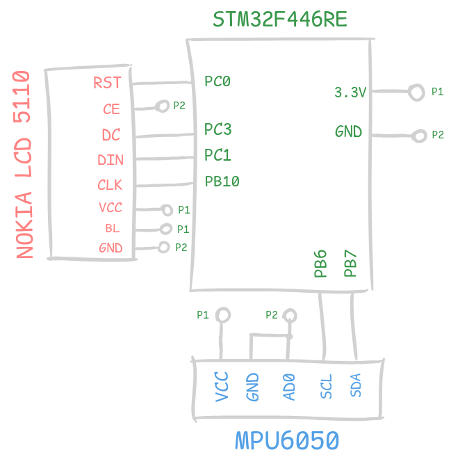
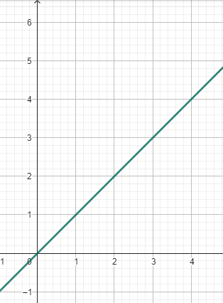
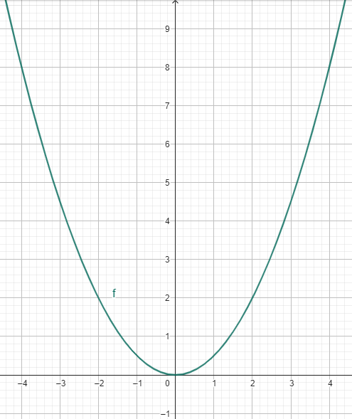
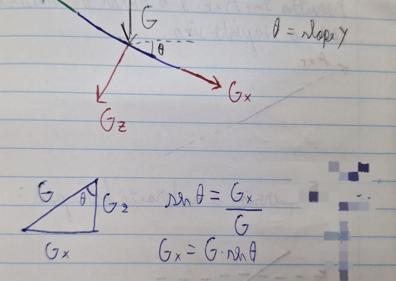
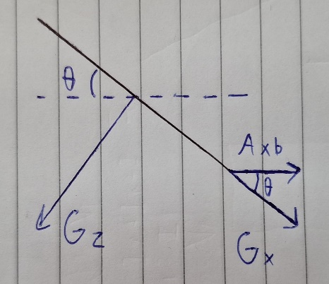
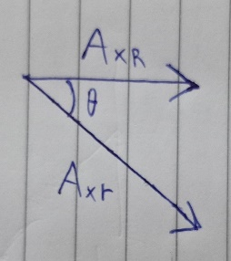
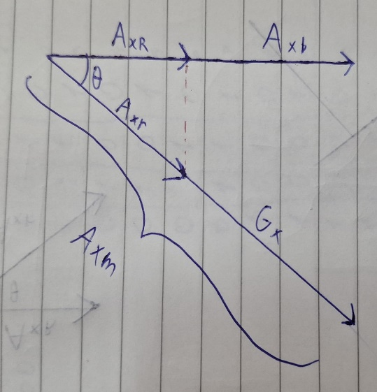
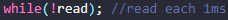
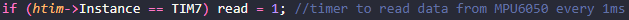

# Air Hockey - V0.1
By Davi da Silva Schuch and Edrick Thomé de Oliveira \
Sistemas Microprocessados II - Professor Marcos Zuccolotto

## Table of Contents
- [Briefing](#briefing)
    - [Technologies Used](#technologies-used)
    - [Schematic Diagram](#schematic-diagram)
- [SPI](#spi)
    - [Pins](#pins)
    - [Shift Register / Operation Modes](#shift-register--operation-modes)
    - [Clock Polarity and Phase](#clock-polarity-and-phase)
- [Nokia 5110 LCD Display](#nokia-5110-lcd-display)
    - [Pins](#pins-1)
    - [Library](#library)
- [Game](#game)
    - [Order and Update](#order-and-update)
        - [Display Orientation](#display-orientation)
        - [Update Rate](#update-rate)
    - [Collision](#collision)
        - [Screen Boundaries](#screen-boundaries)
        - [Object Collision](#object-collision)
        - [Puck Acceleration](#puck-acceleration)
        - [Tunneling](#tunneling)
    - [Position Tracking](#position-tracking)
        - [Introduction](#introduction)
        - [Derivative: the "speed" of a function](#derivative-the-speed-of-a-function)      
        - $P(t)$ equation
        - $A(t)$ equation
        - [Customized MPU6050 settings](#customized-mpu6050-settings)
        - $G x$ rectification
        - [Slope measurement](#slope-measurement)
        - [Noise filtering](#noise-filtering)
        - [Velocity adjustment](#velocity-adjustment)
        - [Time tracking](#time-tracking)
        

## Briefing
The following project implements a digital adaptation of an air hockey game, using an LCD display for game rendering and an accelerometer and gyroscope module for control.

### Technologies Used
- STM32F446RE Microcontroller
- MPU6050 - 3-axis accelerometer and gyroscope
- Nokia LCD 5110 Display
- SPI serial communication for the display, and I2C for the accelerometer

### Schematic Diagram


## SPI
The SPI protocol is a serial communication method used over short distances, primarily for embedded systems. It operates in a Master-Slave system, meaning the device generating the synchronization signal is the master, and all devices using that signal are slaves.
SPI also supports Full Duplex (simultaneous send/receive), Half Duplex, and Uniplex (only sending or only receiving).

### Pins
SPI communication is done through four pins as shown below:

| Name | Pin | Purpose |
| - | - | - |
| Master Out Slave In | MOSI | Sends commands from master to slave |
| Master In Slave Out | MISO | Sends commands from slave to master |
| Serial Clock | SCK | Sends the clock from master to slaves |
| Slave Select | SS | Activates communication with the slave device |

Alternate names are possible, as will be seen in the LCD display used, due to lack of standardization. It's up to the user to correctly interpret based on documentation and action to be executed.

### Shift Register / Operation Modes
SPI communication happens via a shift register that, at each clock rising edge, shifts one bit from the data register to the right.

As this is a shared register between the Tx FIFO and Rx FIFO, interaction may depend on the operation mode. Here's a simplified block diagram of an SPI master device:

 \
*Source: STM32 SPI Documentation*

Note that MOSI takes the last bit from the register and MISO inserts a bit at the first position. The transmission queue (containing data to be transfered to another device through MOSI) is copied to the shift register, while the reception queue (MISO) receives the data from it.

For simultaneous communication, each bit sent by MOSI returns a bit via MISO, cycling the shift register according to the figure below:

 \
*Source: Hackaday*

For this project, we’ll use Uniplex communication, since the LCD display only requires synchronous serial data and has no data output.

### Clock Polarity and Phase
The SPI standard allows configuration of clock behavior through the variables polarity (CPOL) and phase (CPHA).

Polarity indicates the clock’s idle state (0 = low, 1 = high). Phase determines whether reading starts on the first or second clock transition.

Interpreted as:

| CPOL | CPHA | Reading | Transition |
| - | - | - | - |
| 0 | 0 | Rising edge | First |
| 0 | 1 | Falling edge | Second |
| 1 | 0 | Falling edge | First |
| 1 | 1 | Rising edge | Second |

Graph for better understanding:

 \
*Source: STM32 SPI Documentation*

**Sources:**
- "Interface serial SPI", material developed and provided by Prof. Zuccolotto
- [STM32 Serial Peripheral Interface](https://www.st.com/content/ccc/resource/training/technical/product_training/group0/3e/ee/cd/b7/84/4b/45/ee/STM32F7_Peripheral_SPI/files/STM32F7_Peripheral_SPI.pdf), by STMicroelectronics
- [Comunicação SPI – Parte 1](https://embarcados.com.br/spi-parte-1/), by embarcados.com.br
- [Comunicação SPI - Parte 2](https://embarcados.com.br/comunicacao-spi-parte-2/), by embarcados.com.br
- [What could go wrong: SPI](https://hackaday.com/2016/07/01/what-could-go-wrong-spi/), by hackaday.com

## Nokia 5110 LCD Display
Used for output, the LCD 5110 display is widely available and low cost. With 48 rows and 84 columns, it supports only one color, has a max serial input rate of 4 Mbps, and is CMOS-compatible.

### Pins
Pinout of the used device (note that names may vary due to lack of standardization):

| Name | Pin | Purpose |
| - | - | - |
| - | VCC | Power supply |
| - | GND | Ground |
| Back Light | BL | Display backlight |
| Data Input | DIN | Serial data input |
| Clock | CLK | Clock input |
| Chip Enable | CE | Enables serial data reception |
| Data/Command | D/C | Switches operation mode |
| Reset | RST | Clears the display memory |

 \
*Source: ETT Documentation*

This display lacks a data output and only depends on master outputs, so only master outputs are used in SPI configuration.

Manual control of reset, data/command, and chip enable pins is required for full operation.

### Library
With display and protocol documentation in hand, we could create our own driver. But to simplify, we use a public library from GitHub, abstracting initialization, data sending, and port toggling.

Library used: "winxos/stm32_hal_lcd5110_hw_spi", retrieved on May 23, 2025. Available [here](https://github.com/winxos/stm32_hal_lcd5110_hw_spi).

## Game
The game consists of two objects: a "puck" and a "paddle", both block-shaped. Collision must be programmed, requiring both objects to have position, direction, speed, etc.

### Order and Update
#### Display Orientation
The display’s coordinate system does not match Cartesian: x increases to the right, but y increases downward.

 \
*Source: Own authorship*

#### Update Rate
To simplify programming and leverage microcontroller tools, movement speed is controlled by a timer that regulates the position update rate.

Example code for updating the ball’s position:

```
void HAL_TIM_PeriodElapsedCallback(TIM_HandleTypeDef *htim) {
	if (htim->Instance == TIM11) {  //10Hz
		moveBall(); //update ball position
    }
    if (htim->Instance == TIM14) {  //50Hz
        ... //update screen
    }
}

void moveBall() { //increase or decrease position by one
    if (ball.xDirection == UP) ball.xPosition = ++ball.xPosition;
    else ball.xPosition = --ball.xPosition;

    if (ball.yDirection == LEFT) ball.yPosition = ++ball.yPosition;
    else ball.yPosition = --ball.yPosition;
}
```

### Collision
Collision is key — when objects touch, the player's movement affects the puck. Current implementation is discrete, checking if objects are currently overlapping.

#### Screen Boundaries
First, we handle screen boundary collisions: if the paddle hits the screen edge, it stops. For the puck, we check if it hit a horizontal or vertical edge, and invert the corresponding direction.

#### Object Collision
Occurs when any edge or diagonal of one object aligns with the other's. Given that object position is its center, we calculate edges using width and height:

 \
*Source: Own authorship*

```
int p = stick.yPosition - (stick.height / 2),
    q = stick.yPosition + (stick.height / 2),
    r = stick.xPosition - (stick.width / 2),
    s = stick.xPosition + (stick.width / 2);
int x = ball.xPosition, y = ball.yPosition;
```

As noted earlier, remember the y-axis increases downward.

To detect collisions (e.g., right edge of paddle), check if y is between *p* and *q* and x equals *s*:

```
if ((y > p) && (y < q) && (x == s)) { //right side collision
    ...
}
```

#### Puck Acceleration
When a collision is detected, the puck must speed up. Since force isn't implemented, we use the update timer.

On collision, the update rate changes from 10 Hz to 50 Hz for one second, simulating a speed increase, then reverts.

#### Tunneling
With variable speeds, a problem called tunneling may occur: if an object moves considerably quicker than the other, its position may change in a way that it tunnels through the object it should collide with. In our application, the puck can move past the paddle without detection. Below, expected behavior is on the left, tunneling on the right:

 \
*Source: Own authorship*

To fix this, a continuous collision algorithm is required, predicting the object's path and collision point.

### Position Tracking
This is how we track the 2D position of the sensor over time.

#### Introduction

The main idea behind the position tracking algorithm is to use the acceleration data provided by the MPU6050 sensor to calculate where it should be at each time interval. It's as if someone were blindfolded in a car and had to determine where they would be as time goes by.

At first, it wouldn't be hard to tell if the car drove forwards or backwards, to the right or to the left. However, as it moves around, the sense of displacement becomes distorted, as the person can't keep track of exactly how much they've moved.

We should experience a similar problem when dealing with the accelerometer. But unlike a person, its better precision and the fact that it senses acceleration as a number might make it possible to, at least, accomplish the specific task: tracking a 2D position over time.

#### Derivative: the "speed" of a function

Consider the function $f(x)=x$ :



Note that its increment rate is constant. That means that the function increases at the same rate, regardless of where it is in the domain. The speed, or the increasing rate of the function is given by $\frac{d y}{d x}=\frac{f(x)-f\left(x_{0}\right)}{x-x_{0}}$, which representes how much it grew (dy) between two points in the domain (dx). This is the average speed between $x_{0}$ and $x$. In this case, it is constant - any $\frac{f(x)-f\left(x_{0}\right)}{x-x_{0}}$ will have the same result, which is 1 . That means that each increment of 1 in the domain increases $y$ by 1 .

In non-linear functions, the same rule is valid, but there's a catch. Take $f(x)=$ $\frac{x^{2}}{2}$ as an example: 



Now, $\frac{d y}{d x}$ is not the same across the domain. The speed changes. If you take two random $x_{0}$ and $x$ to calculate $\frac{d y}{d x}$, what you get is the average speed between $x_{0}$ and $x$. The speed at an instant $x$ is therefore given by $\frac{d y}{d x}$, where $d x\left(x-x_{0}\right)$ is infinitely close to zero, but not zero. If you're willing to lose precision, $d x$ can just be considerably small instead of infinitesimally close to zero.

This applies to position and velocity, as velocity is the rate at which position varies. The same relationship exists between velocity and acceleration, as acceleration is "the speed of velocity."

#### $P(t)$ equation

Using the $\frac{d y}{d x}$ equation and starting from the acceleration:

$$
A(t)=\frac{V(t+d t)-V(t)}{d t}
$$

Reformulating:

$$
V(t+d t)=A(t) \times d t+V(t)
$$

Or:

$$
V(t)=A(t-d t) \times d t+V(t-d t)
$$

At the first iteration (the calibration), we consider $V(t)=0$. That's why the sensor must be still during calibration. Then, for the next iterations, $V(t-1)$ is simply the last calculated velocity.

Generalizing the iterations:

$$
\begin{aligned}
& d t_{i}=t_{i}-t_{0} \\
& t_{n}=\sum_{i \in \mathbb{N}}^{n} d t_{i} \mid d t_{0}=0 \\
& V\left(t_{n}\right)=\sum_{i \in \mathbb{N}^{*}}^{n} A\left(t_{i-1}\right) \times d t_{i} \\
& P\left(t_{n}\right)=\sum_{i \in \mathbb{N}^{*}}^{n} V\left(t_{i-1}\right) \times d t_{i}
\end{aligned}
$$

Thus, to track position over time, we just have to measure multiple $A(t)$, with the smallest $d t$ possible so the equaitons are valid (i.e., closely resemble real values), and use them to calculate $V(t)$ and $P(t)$. Do this for both axes in parallel, and what you get is a real-time ( $x, y$ ) coordinate-that is, the position.

#### $A(t)$ measurement

The MPU6050 sensor is equipped with an accelerometer, a gyroscope, and a thermometer. The data is displayed in registers according to the Register Map, available in "MPU 6050 Register Map and Descriptions.pdf" in this repository.

To make reading easier and focus on data processing, we used public software by Bulanov Konstantin (mpu6050.c), which initializes the sensor (a few settings were changed to better suit our application-details later) and provides functions that read the desired registers via I2C communication and convert them to standard units (such as $g$ for acceleration), assigning these values to variables in a struct.

#### Customized MPU6050 settings

One of the changed settings was SMPLRT_DIV. The value written in this register determines the divider from the sensor's output rate. The maximum sample rate happens when SMPLRT_DIV $=0 \times 00$, and is 1 kHz (accelerometer). In Konstantin's code it was set to $0 x 07$. A complete explanation can be found in topic 4.2 of "MPU 6050 Register Map and Descriptions.pdf".

The other was DLPF, which stands for "Digital Low-Pass Filter." It filters some of the noise, and the downside is that it delays the data slightly. That means when an acceleration occurs, it's going to be measured a few milliseconds later, according
to the table in topic 4.3. Further explanations on DLPF can be found there, and also in "Using the MPU6050's DLPF.txt," available in this repository.

#### $G x$ rectification

The MPU6050 perceives gravity as acceleration. The $\boldsymbol{A z}$ (Z-axis acceleration) should be $1 g$ when the sensor is parallel to the ground, but this never actually happens. There's always a slope that divides gravity into two components -let's call them $G x$ and $G z$. They assume values according to the triangle below (vector decomposition):



When at rest, the measured X -axis acceleration (let's call it $A x_{m}$ ) will be equal to $G x$, and parallel to the ground is a vector we call "acceleration bias" $\left(A x_{b}\right)$ :



When there is some acceleration instead of zero, the vectors look like this:



On the horizontal plane, the real acceleration $\left(A x_{R}\right)$ won't be measured. But it causes a relative acceleration ( $A x_{r}$ ) according to $A x_{R}=A x_{r} \times \cos \theta$. These vectors are summed with $G x$ and $A x_{b}$, which are constant (as long as $\theta$ doesn't change).



To find out $A x_{R}$, we subtract our reading ( $A x_{m}$ ) by the known $G x$. The result is $A x_{r}$. Then we multiply it by the cossine of $\theta$ and what you get is $A x_{R}$. Summing up and generalizing:

To find out $A x_{R}$, we subtract our reading $\left(A x_{m}\right)$ by the known $G x$. The result is $A x_{r}$. Then we multiply it by the cosine of $\theta$, and what you get is $A x_{R}$. Summing up and generalizing:

$$
A x_{R}=\cos \theta \times\left(A x_{m}+G \times \sin \theta\right)
$$

We add instead of subtracting $G x$ because the MPU6050's orientation is as follows:


So a positive $Y$-axis slope $(\theta>0)$ generates a negative $G x$, and that's why we add instead of subtract. On the other hand, a positive X -axis slope $(\alpha>0)$ results in a positive Gy. So:

$$
A y_{R}=\cos \alpha \times\left(A y_{m}-G \times \sin \alpha\right)
$$

#### Slope measurement

For these equations to work, both X and Y axis slopes have to be measured accurately and can't change over time. The simplest way to do this would be to get $G x$ while there's no motion, when:

$$
\theta=\sin ^{-1} \frac{G x}{G}
$$

For testing purposes, we tracked $\theta$ over a period of time, with the sensor both stopped and in motion. As expected, when real acceleration is applied, the equation stops providing the real slope. When at rest, we did get the correct angle of the slope as we changed it, but there was heavy noise due to noisy acceleration data. This could lead to imprecise slope values and thus poor accuracy of $A x_{R}$ and $A y_{R}$.

A "Kalman filter" is a mathematical tool that filters noise and can provide accurate slope estimates. Its algorithm won't be discussed here, but the general idea is to use data from both the accelerometer and gyroscope, and merge them to improve angular measurement accuracy. The downside is that it's a function that converges to the real slope. When the slope changes, the Kalman filter temporarily outputs an incorrect value. Therefore, it's not possible to track real-time slope using a Kalman filter-also because acceleration leads to incorrect values.

The solution developed was to measure $\theta$ using the Kalman filter only during the calibration step. During calibration, we presume the sensor is completely at rest, allowing the Kalman filter to converge and output an accurate slope value for both horizontal axes.

A possible improvement would be, starting after calibration, to track changes in slope using only gyroscope data, which is influenced only by rotation and not acceleration. This would solve the current problem where, if the user accidentally pitches or rolls the board the circuit is built on, acceleration is measured and leads to unwanted movement of the user-controlled block.

#### Noise filtering

When at rest, tests were carried out to determine the noise characteristics in the acceleration readings. An array of 500 elements was filled with data, with the sensor completely stopped during and after calibration.

The results showed that the average between negative and positive values was $+5 \mathrm{~mm} / \mathrm{s}^{2}$. The average of the absolute value (distance to zero) of the 500 readings was $24.5 \mathrm{~mm} / \mathrm{s}^{2}$. The maximum reading (in absolute value) among the 500 was, on average, $100.3 \mathrm{~mm} / \mathrm{s}^{2}$.

In conclusion, we are not considering acceleration measurements whose absolute value is less than $100 \mathrm{~mm} / \mathrm{s}^{2}$.

#### Velocity adjustment

Because of the inaccurate nature of the sensor, when shifted from point A to point B , the velocity measured increases and then decreases, but never returns exactly to zero-where it should be when at rest.

The solution found was to check the most recent values of acceleration and, if all of them were zero, set the velocity to zero too. This means that the velocity must be replaced by 0 if acceleration has been zero recently. The only situation where this would be a bug would be if it were moving at constant speed. However, this situation will never happen, as it is virtually impossible to move the board by hand without any velocity disturbance.

#### Time tracking

A timer (TIM7) was set to trigger every 1 ms -the highest possible sample rate. Each time it fires, MPU acceleration data is read and sent to be processed. Because of this fixed $d t$ of 1 ms , each $t_{n}$ is assumed as $t_{i}+1 \mathrm{~ms}$, and this works because the time from timer trigger to acceleration measurement is negligible.

The code execution stops at this line:



And only resumes when the TIM7 interrupt is executed.


